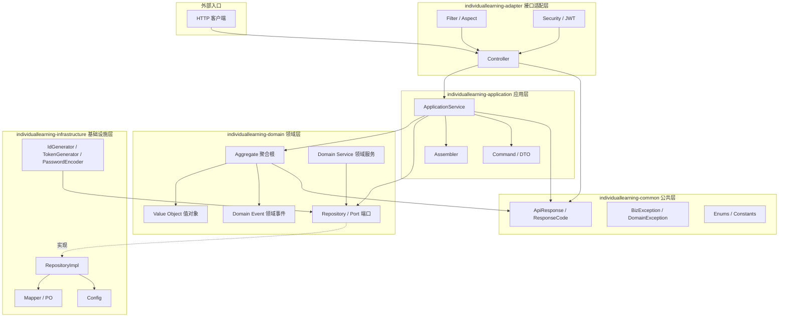
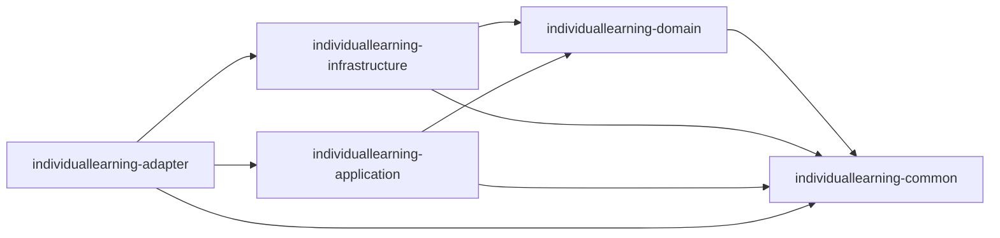
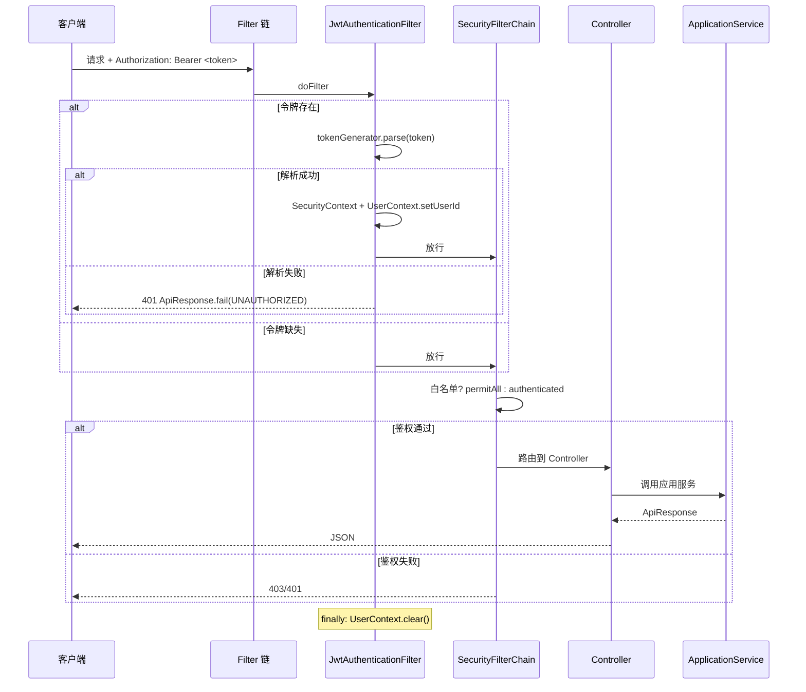
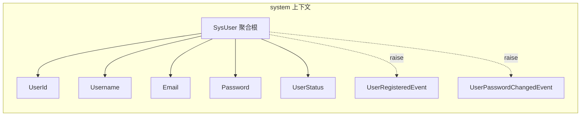
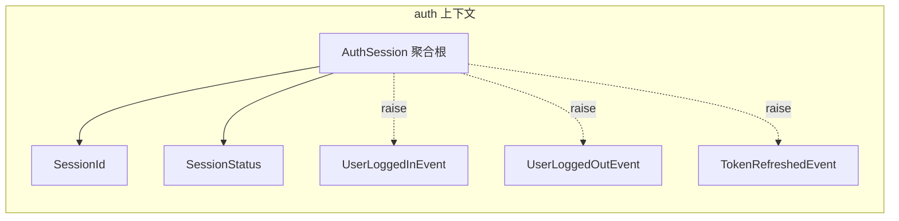
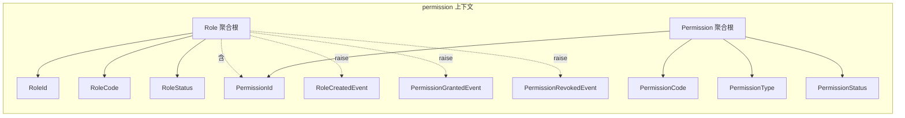

# individual-learning 企业级 DDD 脚手架

> 基于 JDK 21 + Spring Boot 3.2.5 + MyBatis Plus 3.5.7 的企业级 DDD（领域驱动设计）分层架构脚手架。
> 严格遵循"依赖倒置、富领域模型、端口适配器"原则，提供用户、认证、权限三大限界上下文的完整实现。

## 目录

- [项目简介](#项目简介)
- [技术栈](#技术栈)
- [架构设计](#架构设计)
- [模块详解](#模块详解)
  - [individuallearning-common 公共层](#individuallearning-common-公共层)
  - [individuallearning-domain 领域层](#individuallearning-domain-领域层)
  - [individuallearning-infrastructure 基础设施层](#individuallearning-infrastructure-基础设施层)
  - [individuallearning-application 应用层](#individuallearning-application-应用层)
  - [individuallearning-adapter 接口适配层](#individuallearning-adapter-接口适配层)
- [模块依赖关系](#模块依赖关系)
- [依赖清单](#依赖清单)
- [数据库设计](#数据库设计)
- [配置说明](#配置说明)
- [安全鉴权](#安全鉴权)
- [横切关注点](#横切关注点)
- [领域模型](#领域模型)
- [测试体系](#测试体系)
- [快速开始](#快速开始)

---

## 项目简介

`individual-learning` 是一套面向中后台系统的 DDD 脚手架，目标是用**最朴素的工程约定**落地"领域驱动设计 + 端口适配器架构（Hexagonal）"，让业务规则回归领域层，让基础设施可替换。

### 设计理念

| 理念 | 落地方式 |
| --- | --- |
| **DDD 五层架构** | common / domain / infrastructure / application / adapter 五个 Maven 模块，编译期隔离依赖方向 |
| **端口模式（Hexagonal）** | 领域层定义 `Repository` / `IdGenerator` / `PasswordEncoder` / `TokenGenerator` / `DomainEventPublisher` 等端口接口，基础设施层提供实现 |
| **富领域模型** | 聚合根不暴露 setter，行为方法内聚业务规则；值对象构造期校验；聚合根收集领域事件 |
| **依赖倒置** | domain 模块只依赖 individuallearning-common，不引入 Spring / MyBatis 等技术框架；infrastructure 反向依赖 domain |
| **预生成 ID** | 雪花 ID 在领域层生成，避免"插入后取主键"，便于分库分表与领域事件携带 ID |
| **PO 隔离** | 持久化对象（PO）只存活于 infrastructure，领域层永远不感知表结构 |

---

## 技术栈

| 技术 | 版本 | 用途 |
| --- | --- | --- |
| JDK | 21 | 运行时基线，启用 record / pattern matching 等新特性 |
| Spring Boot | 3.2.5 | Web / Validation / Actuator / Security / AOP / Data Redis / Test |
| MyBatis Plus | 3.5.7 | 持久化（`mybatis-plus-spring-boot3-starter`） |
| MySQL Connector/J | 8.0.33 | MySQL 驱动 |
| HikariCP | 5.0.1 | 数据库连接池（Spring Boot 默认） |
| Spring Security | 6.x（随 Boot） | 鉴权框架，无状态 JWT |
| JJWT | 0.12.6 | JWT 令牌生成与解析 |
| Hutool | 5.8.27 | 工具集（`hutool-crypto` BCrypt、`hutool-core` 雪花算法） |
| Knife4j | 4.5.0 | OpenAPI 3 接口文档 |
| SpringDoc | 2.5.0 | OpenAPI 3 规范实现 |
| Lombok | 1.18.32 | 编译期注解（`@Data` / `@RequiredArgsConstructor` 等） |
| Logback | 随 Boot | 日志框架，支持 traceId MDC |
| JUnit 5 / Mockito / AssertJ | 随 Boot | 单元测试与切片测试 |

---

## 架构设计

### DDD 五层架构



### 依赖方向

- **adapter → application → domain ← infrastructure**
- **application / infrastructure / adapter → common**
- 领域层 `individuallearning-domain` 是依赖箭头的终点，**不依赖任何技术框架**，只依赖 `individuallearning-common`
- 基础设施层 `individuallearning-infrastructure` 反向依赖 `individuallearning-domain`，提供端口实现

### 端口模式说明

| 端口（领域层接口） | 实现（基础设施层） | 说明 |
| --- | --- | --- |
| `SysUserRepository` | `SysUserRepositoryImpl` | 用户聚合仓储 |
| `AuthSessionRepository` | `AuthSessionRepositoryImpl` | 认证会话仓储 |
| `RoleRepository` | `RoleRepositoryImpl` | 角色仓储（维护角色-权限关联） |
| `PermissionRepository` | `PermissionRepositoryImpl` | 权限仓储 |
| `UserRoleRepository` | `UserRoleRepositoryImpl` | 用户-角色关联仓储 |
| `IdGenerator` | `SnowflakeIdGenerator` | 雪花 ID 生成 |
| `PasswordEncoder` | `BCryptPasswordEncoder` | BCrypt 密码加密 |
| `TokenGenerator` | `JwtTokenGenerator` | JWT 令牌生成与解析 |
| `DomainEventPublisher` | `SpringDomainEventPublisher` | 基于 Spring 事件机制广播领域事件 |

---

## 模块详解

### individuallearning-common 公共层

> **模块职责**：提供跨模块共享的统一响应、异常、常量、枚举。无 Spring 依赖，可被任意模块引用。

#### 包结构

```
individuallearning-common/src/main/java/com/frame/common/
├── api/
│   ├── ApiResponse.java
│   ├── ResponseCode.java
│   └── PageResponse.java
├── exception/
│   ├── BizException.java
│   └── DomainException.java
├── enums/
│   ├── CodeEnum.java
│   └── StatusEnum.java
└── constant/
    └── CommonConstant.java
```

#### 类详细说明

| 类名 | 作用 | 关键方法/字段 |
| --- | --- | --- |
| `ApiResponse<T>` | 统一响应结构，字段：`code` / `message` / `data` / `timestamp`（响应时间戳，毫秒） | `success()` / `success(T)` / `fail(ResponseCode)` / `fail(int, String)` / `isSuccess()` |
| `ResponseCode` | 统一响应码枚举，编码规则：0=成功，1xxx=参数，2xxx=业务，3xxx=系统，4xxx=鉴权 | `SUCCESS(0)` / `PARAM_INVALID(1001)` / `FAIL(2000)` / `SYSTEM_ERROR(3001)` / `UNAUTHORIZED(4001)` / `FORBIDDEN(4002)` 等 |
| `PageResponse<T>` | 分页响应结构，字段：`pageNum` / `pageSize` / `total` / `pages` / `data` | `of(long, long, long, List<T>)` |
| `BizException` | 业务异常：应用层/接口层抛出的可预期业务错误，携带 `code` | 构造器：(String) / (int, String) / (ResponseCode) / (ResponseCode, String) |
| `DomainException` | 领域异常：领域层业务规则被破坏时抛出，不依赖任何基础设施 | 构造器同 `BizException` |
| `CodeEnum` | 编码枚举接口，统一 `getCode()` 访问，便于序列化与数据库转换 | `int getCode()` |
| `StatusEnum` | 通用启停状态枚举：`ENABLE(1)` / `DISABLE(0)`，实现 `CodeEnum` | `isEnabled()` |
| `CommonConstant` | 公共常量类 | `NOT_DELETED=0` / `DELETED=1` / `DEFAULT_PAGE_NUM=1` / `DEFAULT_PAGE_SIZE=10` / `CACHE_PREFIX="frame:"` / `DEFAULT_TENANT_ID="000000"` |

#### 模块依赖

- 仅依赖 Lombok、Hutool、Jakarta Validation API、SLF4J API（无 Spring）

---

### individuallearning-domain 领域层

> **模块职责**：承载领域模型（聚合根、实体、值对象、领域事件）、领域服务、Repository 端口接口。
> **保持纯净**：不依赖 Spring / MyBatis / JJWT 等技术框架，所有外部能力以端口形式声明。

#### 包结构

```
individuallearning-domain/src/main/java/com/frame/domain/
├── shared/
│   ├── BaseEntity.java
│   ├── AggregateRoot.java
│   ├── Identifier.java
│   ├── IdGenerator.java
│   ├── DomainEvent.java
│   └── DomainEventPublisher.java
├── system/                                  # 用户限界上下文
│   ├── model/
│   │   ├── aggregate/SysUser.java
│   │   ├── valobj/
│   │   │   ├── UserId.java
│   │   │   ├── Username.java
│   │   │   ├── Email.java
│   │   │   ├── Password.java
│   │   │   └── UserStatus.java
│   │   └── event/
│   │       ├── UserRegisteredEvent.java
│   │       └── UserPasswordChangedEvent.java
│   ├── service/
│   │   ├── SysUserDomainService.java
│   │   └── PasswordEncoder.java            # 端口
│   └── repository/
│       └── SysUserRepository.java          # 端口
├── auth/                                    # 认证限界上下文
│   ├── model/
│   │   ├── aggregate/AuthSession.java
│   │   ├── valobj/
│   │   │   ├── SessionId.java
│   │   │   └── SessionStatus.java
│   │   └── event/
│   │       ├── UserLoggedInEvent.java
│   │       ├── UserLoggedOutEvent.java
│   │       └── TokenRefreshedEvent.java
│   ├── service/
│   │   ├── AuthDomainService.java
│   │   └── TokenGenerator.java             # 端口
│   └── repository/
│       └── AuthSessionRepository.java      # 端口
└── permission/                              # 权限限界上下文
    ├── model/
    │   ├── aggregate/
    │   │   ├── Role.java
    │   │   └── Permission.java
    │   ├── valobj/
    │   │   ├── RoleId.java
    │   │   ├── RoleCode.java
    │   │   ├── RoleStatus.java
    │   │   ├── PermissionId.java
    │   │   ├── PermissionCode.java
    │   │   ├── PermissionType.java
    │   │   └── PermissionStatus.java
    │   └── event/
    │       ├── RoleCreatedEvent.java
    │       ├── PermissionGrantedEvent.java
    │       └── PermissionRevokedEvent.java
    ├── service/
    │   └── PermissionDomainService.java
    └── repository/
        ├── RoleRepository.java             # 端口
        ├── PermissionRepository.java       # 端口
        └── UserRoleRepository.java         # 端口
```

#### 共享内核（shared 包）类说明

| 类名 | 作用 | 关键方法/字段 |
| --- | --- | --- |
| `BaseEntity<I extends Identifier<?>>` | 实体基类，按 `id` 判等 | `getId()` / `setId(I)` / `equals` / `hashCode` |
| `AggregateRoot<I extends Identifier<?>>` | 聚合根基类，继承 `BaseEntity`，维护领域事件集合 | `raiseEvent(DomainEvent)` / `domainEvents()` / `pullEvents()` |
| `Identifier<T extends Serializable>` | 标识值对象基类，按 `value` 比较 | `getValue()` / `equals` / `hashCode` / `toString` |
| `IdGenerator` | ID 生成器端口 | `long nextId()` |
| `DomainEvent` | 领域事件基类，含 `eventId` (UUID) / `occurredOn` (Instant) | `getEventId()` / `getOccurredOn()` |
| `DomainEventPublisher` | 领域事件发布器端口 | `publish(List<DomainEvent>)` / `publish(DomainEvent)` |

#### system 上下文类说明

| 类名 | 类型 | 作用 | 关键方法/字段 |
| --- | --- | --- | --- |
| `SysUser` | 聚合根 | 系统用户，封装用户核心业务规则 | `register(...)` 工厂方法 / `reconstitute(...)` 重建 / `changePassword(old, new, encoder)` / `updateEmail` / `updateNickname` / `enable` / `disable` / `checkPassword` |
| `UserId` | 值对象 | 用户标识，继承 `Identifier<Long>` | `(Long value)` |
| `Username` | 值对象 | 用户名，正则 `^[a-zA-Z][a-zA-Z0-9_]{2,19}$` | `getValue()` |
| `Email` | 值对象 | 邮箱，构造期校验格式 | `getValue()` |
| `Password` | 值对象 | 密码，内部保存已编码值；明文校验规则：8-32 位且必须含字母与数字 | `encode(raw, encoder)` / `ofEncoded(encoded)` / `matches(raw, encoder)` |
| `UserStatus` | 值对象 | 用户状态：1=启用 / 0=禁用；切换非法状态抛 `DomainException` | `enabled()` / `disabled()` / `enable()` / `disable()` |
| `UserRegisteredEvent` | 领域事件 | 用户注册成功 | `userId` / `username` / `email` |
| `UserPasswordChangedEvent` | 领域事件 | 用户密码修改 | `userId` |
| `SysUserDomainService` | 领域服务 | 跨聚合/需仓储的领域逻辑：注册时校验用户名唯一、预生成 ID | `register(Username, Password, Email)` |
| `PasswordEncoder` | 端口接口 | 密码编码器端口 | `encode(raw)` / `matches(raw, encoded)` |
| `SysUserRepository` | 端口接口 | 用户聚合仓储 | `findById` / `findByUsername` / `existsByUsername` / `save` / `remove` |

#### auth 上下文类说明

| 类名 | 类型 | 作用 | 关键方法/字段 |
| --- | --- | --- | --- |
| `AuthSession` | 聚合根 | 认证会话，封装会话生命周期 | `create(...)` / `reconstitute(...)` / `refresh(newAccess, newRefresh, newExpire, newRefreshExpire)` / `logout()` / `isActive()` / `isRefreshable()` |
| `SessionId` | 值对象 | 会话标识，继承 `Identifier<Long>` | `(Long value)` |
| `SessionStatus` | 值对象 | 会话状态：1=ACTIVE / 0=EXPIRED / 2=REVOKED；非 active 状态禁止 revoke | `active()` / `revoked()` / `expired()` / `revoke()` / `isActive()` / `isRevoked()` |
| `UserLoggedInEvent` | 领域事件 | 用户登录成功 | `userId` / `sessionId` / `loginIp` |
| `UserLoggedOutEvent` | 领域事件 | 用户登出 | `userId` / `sessionId` |
| `TokenRefreshedEvent` | 领域事件 | 令牌刷新 | `userId` / `sessionId` |
| `AuthDomainService` | 领域服务 | 创建会话、刷新会话、登出，不承担持久化 | `createSession(UserId, username, loginIp, TokenGenerator)` / `refreshSession(session, username, TokenGenerator)` / `logout(session)` |
| `TokenGenerator` | 端口接口 | 令牌生成器端口，含 `TokenPair` / `ParsedToken` record | `generate(userId, username)` / `parse(accessToken)` |
| `AuthSessionRepository` | 端口接口 | 会话仓储 | `findById` / `findByAccessToken` / `findByRefreshToken` / `save` / `remove` |

#### permission 上下文类说明

| 类名 | 类型 | 作用 | 关键方法/字段 |
| --- | --- | --- | --- |
| `Role` | 聚合根 | 角色，封装角色权限集合的一致性 | `create(...)` / `reconstitute(...)` / `grantPermission(PermissionId)` / `revokePermission(PermissionId)` / `hasPermission` / `enable` / `disable` / `updateInfo` / `getPermissions()` 不可变视图 |
| `Permission` | 聚合根 | 权限，类型分菜单/按钮/API | `create(...)` / `reconstitute(...)` / `updateInfo` / `enable` / `disable` |
| `RoleId` / `PermissionId` | 值对象 | 角色/权限标识 | `(Long value)` |
| `RoleCode` | 值对象 | 角色编码，正则 `^[A-Z][A-Z0-9_]{2,29}$` | `getValue()` |
| `PermissionCode` | 值对象 | 权限编码，正则 `^[a-z][a-z0-9:._-]{2,63}$` | `getValue()` |
| `RoleStatus` / `PermissionStatus` | 值对象 | 角色/权限状态：1=启用 / 0=禁用；重复切换抛领域异常 | `enabled()` / `disabled()` / `enable()` / `disable()` |
| `PermissionType` | 值对象 | 权限类型：1=菜单 / 2=按钮 / 3=API | `menu()` / `button()` / `api()` / `isMenu()` / `isButton()` / `isApi()` |
| `RoleCreatedEvent` | 领域事件 | 角色创建 | `roleId` / `roleCode` / `roleName` |
| `PermissionGrantedEvent` | 领域事件 | 权限授予 | `roleId` / `permissionId` |
| `PermissionRevokedEvent` | 领域事件 | 权限撤销 | `roleId` / `permissionId` |
| `PermissionDomainService` | 领域服务 | 创建角色/权限、授权、撤销；不承担持久化 | `createRole(...)` / `createPermission(...)` / `grantPermission(RoleId, PermissionId)` / `revokePermission(RoleId, PermissionId)` |
| `RoleRepository` | 端口接口 | 角色仓储（含权限 ID 集合） | `findById` / `findByCode` / `existsByCode` / `save` / `remove` / `findAll` |
| `PermissionRepository` | 端口接口 | 权限仓储 | `findById` / `findByCode` / `existsByCode` / `findAll` / `save` / `remove` |
| `UserRoleRepository` | 端口接口 | 用户-角色关联 | `assign(userId, RoleId)` / `revoke(userId, RoleId)` / `findRoleIdsByUserId` / `findUserIdsByRoleId` / `exists` |

#### 模块依赖

- 内部：`individuallearning-common`
- 测试：`junit-jupiter` / `mockito-core` / `assertj-core`

---

### individuallearning-infrastructure 基础设施层

> **模块职责**：提供领域层端口的技术实现（持久化、缓存、ID 生成、密码编码、令牌、事件发布），以及 MyBatis Plus / Redis / Spring 配置。

#### 包结构

```
individuallearning-infrastructure/src/main/java/com/frame/infrastructure/
├── context/
│   └── UserContext.java
├── cache/
│   └── RedisService.java
├── config/
│   ├── MyBatisPlusConfig.java
│   ├── RedisConfig.java
│   ├── IndividuallearningMetaObjectHandler.java
│   ├── SystemServiceConfig.java
│   ├── AuthServiceConfig.java
│   └── PermissionServiceConfig.java
├── event/
│   └── SpringDomainEventPublisher.java
├── security/
│   ├── BCryptPasswordEncoder.java
│   └── JwtTokenGenerator.java
├── id/
│   └── SnowflakeIdGenerator.java
└── persistence/
    ├── po/
    │   ├── SysUserPO.java
    │   ├── AuthSessionPO.java
    │   ├── RolePO.java
    │   ├── PermissionPO.java
    │   ├── UserRolePO.java
    │   └── RolePermissionPO.java
    ├── entity/
    │   └── OperationLogPO.java
    ├── mapper/
    │   ├── SysUserMapper.java
    │   ├── AuthSessionMapper.java
    │   ├── RoleMapper.java
    │   ├── PermissionMapper.java
    │   ├── UserRoleMapper.java
    │   ├── RolePermissionMapper.java
    │   └── OperationLogMapper.java
    ├── converter/
    │   ├── SysUserConverter.java
    │   ├── AuthSessionConverter.java
    │   ├── RoleConverter.java
    │   └── PermissionConverter.java
    └── repository/
        ├── SysUserRepositoryImpl.java
        ├── AuthSessionRepositoryImpl.java
        ├── RoleRepositoryImpl.java
        ├── PermissionRepositoryImpl.java
        └── UserRoleRepositoryImpl.java
```

#### 类详细说明

##### context 包

| 类名 | 作用 | 关键方法 |
| --- | --- | --- |
| `UserContext` | 基于 `ThreadLocal<Long>` 存储当前操作人 ID，供审计字段填充使用；未登录返回 `0L` | `setUserId(Long)` / `getUserId()` / `clear()` |

##### cache 包

| 类名 | 作用 | 关键方法 |
| --- | --- | --- |
| `RedisService` | 封装 `RedisTemplate<String, Object>` 常用操作，屏蔽模板细节 | `set` / `set(key, value, Duration)` / `get` / `delete` / `exists` / `setIfAbsent(key, value, Duration)`（用于幂等） / `expire` / `keys(pattern)`（基于 scan） |

##### config 包

| 类名 | 作用 | 关键内容 |
| --- | --- | --- |
| `MyBatisPlusConfig` | 配置分页插件 `PaginationInnerInterceptor(DbType.MYSQL)`；`@MapperScan("com.individuallearning.infrastructure.persistence.mapper")` 显式声明在此处（避免 `@WebMvcTest` 切片测试加载 Mapper） | `mybatisPlusInterceptor()` |
| `RedisConfig` | 统一 `RedisTemplate` 序列化：key 用 `StringRedisSerializer`，value 用 `GenericJackson2JsonRedisSerializer` | `redisTemplate(connectionFactory)` |
| `IndividuallearningMetaObjectHandler` | MyBatis Plus 自动填充：插入时填 `createTime` / `updateTime` / `creator` / `updater`；更新时填 `updateTime` / `updater` | `insertFill` / `updateFill` |
| `SystemServiceConfig` | 领域服务装配：把 `SysUserDomainService`（纯 POJO）注入仓储与 IdGenerator 后注册为 Spring Bean | `sysUserDomainService(...)` |
| `AuthServiceConfig` | 同上，装配 `AuthDomainService` | `authDomainService(IdGenerator)` |
| `PermissionServiceConfig` | 同上，装配 `PermissionDomainService` | `permissionDomainService(...)` |

##### event 包

| 类名 | 作用 |
| --- | --- |
| `SpringDomainEventPublisher` | 实现 `DomainEventPublisher`，借助 Spring `ApplicationEventPublisher` 广播事件，监听器可 `@Async` + `@TransactionalEventListener(AFTER_COMMIT)` 异步处理 |

##### security 包

| 类名 | 作用 | 关键方法 |
| --- | --- | --- |
| `BCryptPasswordEncoder` | 实现 `PasswordEncoder`，基于 Hutool `BCrypt` | `encode(raw)` / `matches(raw, encoded)` |
| `JwtTokenGenerator` | 实现 `TokenGenerator`，基于 jjwt 0.12.6；HMAC-SHA256；构造期校验 secret 至少 32 字符；access token 携带 `username`/`type=access` | `generate(userId, username)` 返回 `TokenPair` / `parse(accessToken)` 返回 `ParsedToken`，无效抛 `BizException` |

##### id 包

| 类名 | 作用 |
| --- | --- |
| `SnowflakeIdGenerator` | 实现 `IdGenerator`，基于 Hutool `Snowflake`；`workerId` / `dataCenterId` 通过配置注入，多实例需保证唯一 |

##### persistence.po 包（持久化对象，与表一一对应）

| PO 类名 | 对应表 | 说明 |
| --- | --- | --- |
| `SysUserPO` | `sys_user` | `@TableId(INPUT)` 雪花 ID、`@TableLogic` 逻辑删除、`@TableField(fill=...)` 审计字段 |
| `AuthSessionPO` | `auth_session` | 同上 |
| `RolePO` | `sys_role` | 同上 |
| `PermissionPO` | `sys_permission` | 同上 |
| `UserRolePO` | `sys_user_role` | 物理删除，无逻辑删除字段 |
| `RolePermissionPO` | `sys_role_permission` | 物理删除，无逻辑删除字段 |
| `OperationLogPO`（位于 `entity` 包） | `sys_operation_log` | 操作日志，含 `operator` / `module` / `type` / `description` / `method` / `params` / `durationMs` / `success` / `errorMsg` |

##### persistence.mapper 包

| Mapper | 继承 | 说明 |
| --- | --- | --- |
| `SysUserMapper` / `AuthSessionMapper` / `RoleMapper` / `PermissionMapper` / `UserRoleMapper` / `RolePermissionMapper` / `OperationLogMapper` | `BaseMapper<XxxPO>` | MyBatis Plus 自动提供单表 CRUD，仅在基础设施层可见 |

##### persistence.converter 包

| Converter | 作用 |
| --- | --- |
| `SysUserConverter` | `SysUser` 聚合 ↔ `SysUserPO` 互转；时间字段由 `MetaObjectHandler` 维护，不在此映射 |
| `AuthSessionConverter` | `AuthSession` 聚合 ↔ `AuthSessionPO` 互转 |
| `RoleConverter` | `Role` 聚合 ↔ `RolePO` 互转；`toPO` 不处理 permissions（关联表单独维护），`toDomain` 需传入 `permissionIds` 重建权限集合 |
| `PermissionConverter` | `Permission` 聚合 ↔ `PermissionPO` 互转 |

##### persistence.repository 包

| RepositoryImpl | 端口 | 关键实现 |
| --- | --- | --- |
| `SysUserRepositoryImpl` | `SysUserRepository` | `existsByUsername` 用 `Wrappers.lambdaQuery`；`save` 用 `Db.saveOrUpdate` |
| `AuthSessionRepositoryImpl` | `AuthSessionRepository` | 支持按 `accessToken` / `refreshToken` 查询 |
| `RoleRepositoryImpl` | `RoleRepository` | `save` 时**增量更新**角色-权限关联表：仅删除被移除的、插入新增的；`remove` 时级联删除关联 |
| `PermissionRepositoryImpl` | `PermissionRepository` | 标准 CRUD |
| `UserRoleRepositoryImpl` | `UserRoleRepository` | `assign` 前判重；`revoke` 按复合条件删除 |

#### 模块依赖

- 内部：`individuallearning-domain` / `individuallearning-common`
- 第三方：`spring-boot-starter` / `spring-boot-starter-data-redis` / `mybatis-plus-spring-boot3-starter` / `mysql-connector-j` (runtime) / `HikariCP` / `jjwt-api` / `jjwt-impl` (runtime) / `jjwt-jackson` (runtime) / Lombok

---

### individuallearning-application 应用层

> **模块职责**：用例编排、事务控制、DTO 装配、领域事件发布。**不承载核心业务规则**。

#### 包结构

```
individuallearning-application/src/main/java/com/frame/application/
├── auth/
│   ├── service/AuthApplicationService.java
│   ├── command/
│   │   ├── AuthLoginCommand.java
│   │   └── RefreshTokenCommand.java
│   ├── dto/
│   │   ├── TokenDTO.java
│   │   └── LoginUserDTO.java
│   └── assembler/AuthAssembler.java
├── system/
│   ├── service/SysUserApplicationService.java
│   ├── command/
│   │   ├── RegisterCommand.java
│   │   ├── LoginCommand.java
│   │   └── ChangePasswordCommand.java
│   ├── dto/SysUserDTO.java
│   └── assembler/SysUserAssembler.java
└── permission/
    ├── service/
    │   ├── RoleApplicationService.java
    │   └── PermissionApplicationService.java
    ├── command/
    │   ├── CreateRoleCommand.java
    │   ├── UpdateRoleCommand.java
    │   ├── GrantPermissionCommand.java
    │   ├── AssignRoleCommand.java
    │   ├── CreatePermissionCommand.java
    │   └── UpdatePermissionCommand.java
    ├── dto/
    │   ├── RoleDTO.java
    │   └── PermissionDTO.java
    └── assembler/
        ├── RoleAssembler.java
        └── PermissionAssembler.java
```

#### 类详细说明

##### auth 应用服务

| 类名 | 类型 | 作用 | 关键方法 |
| --- | --- | --- | --- |
| `AuthApplicationService` | Service | 编排登录/刷新/登出用例；`@Transactional(rollbackFor=Exception.class)` 控制事务；`pullEvents()` 后发布 | `login(AuthLoginCommand)` → `TokenDTO` / `refresh(RefreshTokenCommand)` → `TokenDTO` / `logout(accessToken)` |
| `AuthLoginCommand` | record | 登录命令：`username` / `password` / `loginIp` | — |
| `RefreshTokenCommand` | record | 刷新命令：`refreshToken` | — |
| `TokenDTO` | record | 令牌视图：`accessToken` / `refreshToken` / `expiresIn`（剩余秒数） / `user` | — |
| `LoginUserDTO` | record | 登录用户简要视图：`id` / `username` / `nickname` | — |
| `AuthAssembler` | 装配器 | `AuthSession` + `SysUser` → `TokenDTO`，计算 `expiresIn` | `toTokenDTO(session, user)` |

##### system 应用服务

| 类名 | 类型 | 作用 | 关键方法 |
| --- | --- | --- | --- |
| `SysUserApplicationService` | Service | 编排注册/登录/改密/查询/启停用例 | `register(RegisterCommand)` / `login(LoginCommand)` / `changePassword(ChangePasswordCommand)` / `getProfile(userId)` / `disable(userId)` / `enable(userId)` |
| `RegisterCommand` | record | 注册命令：`username` / `password` / `email` | — |
| `LoginCommand` | record | 登录命令：`username` / `password` | — |
| `ChangePasswordCommand` | record | 改密命令：`userId` / `oldPassword` / `newPassword` | — |
| `SysUserDTO` | record | 用户视图：`id` / `username` / `email` / `nickname` / `status` / `createTime` | — |
| `SysUserAssembler` | 装配器 | `SysUser` → `SysUserDTO` | `toDTO(user)` |

##### permission 应用服务

| 类名 | 类型 | 作用 | 关键方法 |
| --- | --- | --- | --- |
| `RoleApplicationService` | Service | 编排角色创建/更新/授权/分配用例 | `createRole` / `updateRole` / `grantPermission` / `revokePermission` / `assignRole` / `revokeRole` / `getRole` / `listRoles` |
| `PermissionApplicationService` | Service | 编排权限创建/更新/查询用例 | `createPermission` / `updatePermission` / `getPermission` / `listPermissions` |
| `CreateRoleCommand` / `UpdateRoleCommand` | record | 角色 command：`code` / `name` / `description`；更新含 `roleId` | — |
| `GrantPermissionCommand` | record | 授权命令：`roleId` / `permissionId` | — |
| `AssignRoleCommand` | record | 分配角色命令：`userId` / `roleId` | — |
| `CreatePermissionCommand` / `UpdatePermissionCommand` | record | 权限 command：`code` / `name` / `type` / `parentId` / `sort` | — |
| `RoleDTO` | record | 角色视图：`id` / `code` / `name` / `description` / `status` / `permissionIds`（升序） / `createTime` | — |
| `PermissionDTO` | record | 权限视图：`id` / `code` / `name` / `type` / `parentId` / `sort` / `status` / `createTime` | — |
| `RoleAssembler` / `PermissionAssembler` | 装配器 | 聚合 → DTO | `toDTO(...)` |

#### 模块依赖

- 内部：`individuallearning-domain` / `individuallearning-common`
- 第三方：`spring-context` / `spring-tx`（事务注解）/ Lombok；测试：`spring-boot-starter-test`

---

### individuallearning-adapter 接口适配层

> **模块职责**：HTTP 入口、Spring Security 鉴权、横切关注点（日志/幂等/审计/异常）、系统启动引导。

#### 包结构

```
individuallearning-adapter/src/main/java/com/frame/adapter/
├── IndividuallearningApplication.java                     # 启动引导类
├── config/
│   ├── SecurityConfig.java
│   ├── JwtAuthenticationFilter.java
│   └── WebMvcConfig.java
├── common/
│   ├── Idempotent.java                       # 注解
│   ├── IdempotentAspect.java                 # 切面
│   ├── OperationLog.java                     # 注解
│   ├── OperationLogAspect.java               # 切面
│   ├── TraceIdFilter.java
│   ├── RequestLogFilter.java
│   ├── UserEventListener.java
│   └── GlobalExceptionHandler.java
└── web/
    ├── controller/
    │   ├── SysUserController.java
    │   ├── AuthController.java
    │   ├── RoleController.java
    │   └── PermissionController.java
    └── request/
        ├── RegisterRequest.java
        ├── LoginRequest.java
        ├── ChangePasswordRequest.java
        ├── AuthLoginRequest.java
        ├── RefreshTokenRequest.java
        ├── CreateRoleRequest.java
        ├── UpdateRoleRequest.java
        ├── AssignRoleRequest.java
        ├── GrantPermissionRequest.java
        ├── CreatePermissionRequest.java
        └── UpdatePermissionRequest.java
```

#### 类详细说明

##### 启动引导

| 类名 | 作用 |
| --- | --- |
| `IndividuallearningApplication` | `@SpringBootApplication(scanBasePackages = "com.individuallearning")` + `@EnableAsync`；扫描覆盖 adapter / application / infrastructure；`@MapperScan` 显式放在 `MyBatisPlusConfig` 上以避免 `@WebMvcTest` 触发 Mapper 加载 |

##### config 包

| 类名 | 作用 | 关键内容 |
| --- | --- | --- |
| `SecurityConfig` | Spring Security 配置：禁用 CSRF / Session（`STATELESS`）；白名单放行；其余路径需 JWT 认证；`@EnableMethodSecurity` 支持方法级注解；注册 `JwtAuthenticationFilter` 于 `UsernamePasswordAuthenticationFilter` 之前 | `securityFilterChain` / `passwordEncoder()` (BCrypt) / `authenticationManager(...)` / `corsConfigurationSource()` |
| `JwtAuthenticationFilter` | 继承 `OncePerRequestFilter`；从 `Authorization: Bearer <token>` 头提取令牌；解析后设置 `SecurityContext` 与 `UserContext`；令牌缺失则放行交给 Security 链；无效则直接返回 401 JSON；`finally` 清理 `UserContext` | `doFilterInternal` / `extractToken` / `writeUnauthorizedResponse` |
| `WebMvcConfig` | MVC 配置：全局 CORS，允许所有 Origin/方法/头，`allowCredentials=true`，`maxAge=3600` | `addCorsMappings` |

##### common 包

| 类名 | 类型 | 作用 |
| --- | --- | --- |
| `Idempotent` | 注解 | 防重复提交注解：`@Target(METHOD)`；属性 `window()` 默认 "5s" / `message()` 默认 "请勿重复提交" |
| `IdempotentAspect` | 切面 | 基于 Redis `SET NX` 实现幂等；key = `idempotent:{userId}:{method}:{uri}:{bodyHash}`（body 取 MD5 前 16 位）；窗口内重复抛 `BizException`；执行失败时删除 key 允许重试；时长支持 `ms`/`s`/`m` 后缀 |
| `OperationLog` | 注解 | 操作日志注解：`module()` / `type()` / `desc()` |
| `OperationLogAspect` | 切面 | 拦截 `@OperationLog` 方法，记录操作人/模块/类型/方法/参数/耗时/成功失败/异常，`@Async` 异步写入 `sys_operation_log`；参数超 500 字符截断 |
| `TraceIdFilter` | Filter | `@Order(HIGHEST_PRECEDENCE)`；优先取 `X-Trace-Id` 请求头，否则生成 UUID 前 16 位；写入 MDC `traceId` 并回写响应头；请求结束清理 MDC |
| `RequestLogFilter` | Filter | `@Order(HIGHEST_PRECEDENCE + 1)`；用 `ContentCachingRequestWrapper/ResponseWrapper` 包装请求；记录方法/URI/状态/耗时；DEBUG 级别记录请求体（截断 500 字符）；`finally` 中 `copyBodyToResponse` |
| `UserEventListener` | 监听器 | `@Async` + `@TransactionalEventListener(AFTER_COMMIT)` 监听 `UserRegisteredEvent` / `UserPasswordChangedEvent`，演示领域事件解耦（实际可发邮件/送积分等） |
| `GlobalExceptionHandler` | `@RestControllerAdvice` | 统一异常转 `ApiResponse`：`DomainException` / `BizException` → 400；`MethodArgumentNotValidException` / `BindException` → 400 + 校验消息拼接；兜底 `Exception` → 500 + "系统繁忙" |

##### web.controller 包

| 控制器 | 路由前缀 | 接口 |
| --- | --- | --- |
| `SysUserController` | `/api/v1/sys/user` | `POST /register` 注册 / `POST /login` 登录 / `PUT /password` 改密 / `GET /{userId}` 查看用户 / `PUT /{userId}/disable` 禁用 / `PUT /{userId}/enable` 启用 |
| `AuthController` | `/api/v1/auth` | `POST /login` 登录（返回 TokenDTO） / `POST /refresh` 刷新令牌 / `POST /logout` 登出；从 `X-Forwarded-For` 提取客户端 IP |
| `RoleController` | `/api/v1` | `POST /role` 创建 / `PUT /role/{roleId}` 更新 / `GET /role/{roleId}` 查看 / `GET /role` 列表 / `POST /role/{roleId}/permission` 授权 / `DELETE /role/{roleId}/permission/{permissionId}` 撤权 / `POST /user/{userId}/role` 分配 / `DELETE /user/{userId}/role/{roleId}` 撤销 |
| `PermissionController` | `/api/v1/permission` | `POST` 创建 / `PUT /{permissionId}` 更新 / `GET /{permissionId}` 查看 / `GET` 列表 |

##### web.request 包（全部为 record，含 Jakarta Validation 注解）

| Request | 字段 | 校验 |
| --- | --- | --- |
| `RegisterRequest` | `username` / `password` / `email` | `@NotBlank` + `@Pattern`（用户名） / `@Size(8-32)` / `@Email` |
| `LoginRequest` | `username` / `password` | `@NotBlank` |
| `ChangePasswordRequest` | `userId` / `oldPassword` / `newPassword` | `@NotNull` / `@NotBlank` / `@Size(8-32)` |
| `AuthLoginRequest` | `username` / `password` | `@NotBlank`；`toCommand(loginIp)` 由控制器注入 IP |
| `RefreshTokenRequest` | `refreshToken` | `@NotBlank` |
| `CreateRoleRequest` | `code` / `name` / `description` | `@NotBlank` + `@Pattern`（大写字母） / `@Size(max=64)` / `@Size(max=255)` |
| `UpdateRoleRequest` | `name` / `description` | `@NotBlank` / `@Size(max=64)` / `@Size(max=255)` |
| `AssignRoleRequest` | `roleId` | `@NotNull` |
| `GrantPermissionRequest` | `permissionId` | `@NotNull` |
| `CreatePermissionRequest` | `code` / `name` / `type` / `parentId` / `sort` | `@NotBlank` + `@Pattern`（小写） / `@Size` / `@NotNull` + `@Min(1)` + `@Max(3)` |
| `UpdatePermissionRequest` | `name` / `parentId` / `sort` | `@NotBlank` / `@Size` |

#### 模块依赖

- 内部：`individuallearning-application` / `individuallearning-infrastructure`（让 Spring 扫描到 Repository 实现）/ `individuallearning-common`
- 第三方：`spring-boot-starter-web` / `spring-boot-starter-validation` / `spring-boot-starter-actuator` / `spring-boot-starter-security` / `spring-boot-starter-aop` / `knife4j-openapi3-jakarta-spring-boot-starter` / Lombok；测试：`spring-boot-starter-test`

---

## 模块依赖关系



**依赖矩阵**：

| 模块 | 依赖的内部模块 |
| --- | --- |
| `individuallearning-common` | （无） |
| `individuallearning-domain` | `individuallearning-common` |
| `individuallearning-infrastructure` | `individuallearning-domain` / `individuallearning-common` |
| `individuallearning-application` | `individuallearning-domain` / `individuallearning-common` |
| `individuallearning-adapter` | `individuallearning-application` / `individuallearning-infrastructure` / `individuallearning-common` |

---

## 依赖清单

### 父 POM (`pom.xml`)

通过 `<dependencyManagement>` 统一版本：

| 依赖 | 版本 | 用途 |
| --- | --- | --- |
| `spring-boot-dependencies` BOM | 3.2.5 | 统一管理 Spring Boot 全家桶版本 |
| `mybatis-plus-spring-boot3-starter` | 3.5.7 | Spring Boot 3 专用 MyBatis Plus starter |
| `mysql-connector-j` | 8.0.33 | MySQL JDBC 驱动 |
| `hutool-crypto` / `hutool-core` | 5.8.27 | BCrypt 加密 / 雪花算法等工具 |
| `knife4j-openapi3-jakarta-spring-boot-starter` | 4.5.0 | OpenAPI 3 接口文档 |
| `lombok` | 1.18.32 | 编译期注解（provided） |
| `jjwt-api` / `jjwt-impl` / `jjwt-jackson` | 0.12.6 | JWT API + 运行时实现 + Jackson 序列化 |

构建插件：`spring-boot-maven-plugin` 3.2.5（仅 adapter 模块用 repackage 打可执行 jar）；`maven-compiler-plugin` 3.13.0，`release=21`，`parameters=true`，Lombok 注解处理器。

### individuallearning-common 依赖（5 项）

| 依赖 | 用途 |
| --- | --- |
| `org.projectlombok:lombok` | `@Data` / `@Getter` 等注解 |
| `cn.hutool:hutool-crypto` | 预留（当前 common 未直接使用，未来可做工具类加密） |
| `cn.hutool:hutool-core` | 预留工具支持 |
| `jakarta.validation:jakarta.validation-api` | 仅引入校验 API（`@NotBlank` / `@Pattern` 等），不引入 Spring |
| `org.slf4j:slf4j-api` | 日志 API |

### individuallearning-domain 依赖（5 项）

| 依赖 | 用途 |
| --- | --- |
| `com.individuallearning:individuallearning-common` | 复用 `Result` / `DomainException` / `StatusEnum` 等 |
| `org.projectlombok:lombok` | `@Getter` 等 |
| `org.junit.jupiter:junit-jupiter`（test） | JUnit 5 单元测试 |
| `org.mockito:mockito-core`（test） | Mock 端口依赖 |
| `org.assertj:assertj-core`（test） | 流式断言 |

### individuallearning-infrastructure 依赖（11 项）

| 依赖 | 用途 |
| --- | --- |
| `com.individuallearning:individuallearning-domain` | 实现领域端口 |
| `com.individuallearning:individuallearning-common` | 复用常量/异常 |
| `org.projectlombok:lombok` | 注解 |
| `org.springframework.boot:spring-boot-starter` | Spring 容器基础 |
| `org.springframework.boot:spring-boot-starter-data-redis` | Redis 客户端（Lettuce） |
| `com.baomidou:mybatis-plus-spring-boot3-starter` | MyBatis Plus 持久化 |
| `com.mysql:mysql-connector-j`（runtime） | MySQL 驱动 |
| `com.zaxxer:HikariCP` | 数据库连接池 |
| `io.jsonwebtoken:jjwt-api` | JWT API |
| `io.jsonwebtoken:jjwt-impl`（runtime） | JWT 运行时实现 |
| `io.jsonwebtoken:jjwt-jackson`（runtime） | JWT Jackson 序列化 |

### individuallearning-application 依赖（6 项）

| 依赖 | 用途 |
| --- | --- |
| `com.individuallearning:individuallearning-domain` | 调用领域服务/聚合/端口 |
| `com.individuallearning:individuallearning-common` | 复用 `ApiResponse` / `BizException` |
| `org.projectlombok:lombok` | 注解 |
| `org.springframework:spring-context` | `@Service` / `@Transactional` 等 |
| `org.springframework:spring-tx` | 事务注解支持 |
| `org.springframework.boot:spring-boot-starter-test`（test） | 集成测试 |

### individuallearning-adapter 依赖（10 项）

| 依赖 | 用途 |
| --- | --- |
| `com.individuallearning:individuallearning-application` | 调用应用服务 |
| `com.individuallearning:individuallearning-infrastructure` | 让 Spring 扫描到 Repository / 配置 Bean |
| `com.individuallearning:individuallearning-common` | 复用 `ApiResponse` / 异常 |
| `org.projectlombok:lombok` | 注解 |
| `org.springframework.boot:spring-boot-starter-web` | Web MVC / 内嵌 Tomcat |
| `org.springframework.boot:spring-boot-starter-validation` | Hibernate Validator |
| `org.springframework.boot:spring-boot-starter-actuator` | 健康检查 / 监控端点 |
| `org.springframework.boot:spring-boot-starter-security` | Spring Security 鉴权 |
| `org.springframework.boot:spring-boot-starter-aop` | AOP（`@Idempotent` / `@OperationLog` 切面） |
| `com.github.xiaoymin:knife4j-openapi3-jakarta-spring-boot-starter` | OpenAPI 3 接口文档 |
| `org.springframework.boot:spring-boot-starter-test`（test） | Web 切片测试 |

---

## 数据库设计

数据库：MySQL 8.x，字符集 `utf8mb4`，引擎 `InnoDB`。所有业务表主键为 `BIGINT` 雪花 ID（领域层预生成），主表含审计字段（`creator` / `updater` / `remark` / `create_time` / `update_time`）与逻辑删除 `deleted`。

### `sys_user` 系统用户表

来自 `individuallearning-adapter/src/main/resources/db/schema.sql`。

| 字段 | 类型 | 说明 |
| --- | --- | --- |
| `id` | BIGINT | 主键（雪花 ID，领域预生成） |
| `username` | VARCHAR(64) | 用户名，唯一索引 `uk_username` |
| `password` | VARCHAR(128) | 密码（BCrypt 加密） |
| `email` | VARCHAR(128) | 邮箱 |
| `nickname` | VARCHAR(64) | 昵称 |
| `status` | TINYINT | 状态：1 启用 / 0 禁用 |
| `deleted` | TINYINT | 逻辑删除：0 未删 / 1 已删 |
| `creator` / `updater` | BIGINT | 创建人 / 更新人 |
| `remark` | VARCHAR(500) | 备注 |
| `create_time` / `update_time` | DATETIME | 创建/更新时间 |

### `auth_session` 认证会话表

来自 `individuallearning-adapter/src/main/resources/db/auth-schema.sql`。

| 字段 | 类型 | 说明 |
| --- | --- | --- |
| `id` | BIGINT | 主键（雪花 ID） |
| `user_id` | BIGINT | 用户 ID，普通索引 `idx_user_id` |
| `access_token` | VARCHAR(512) | 访问令牌，唯一索引 `uk_access_token`（前缀 255） |
| `refresh_token` | VARCHAR(512) | 刷新令牌，唯一索引 `uk_refresh_token`（前缀 255） |
| `status` | TINYINT | 状态：1 有效 / 0 过期 / 2 撤销 |
| `login_ip` | VARCHAR(64) | 登录 IP |
| `login_time` | DATETIME | 登录时间 |
| `expire_time` | DATETIME | 访问令牌过期时间 |
| `refresh_expire_time` | DATETIME | 刷新令牌过期时间 |
| `deleted` / `creator` / `updater` / `remark` / `create_time` / `update_time` | — | 审计字段 |

### `sys_role` 角色表

来自 `individuallearning-adapter/src/main/resources/db/permission-schema.sql`。

| 字段 | 类型 | 说明 |
| --- | --- | --- |
| `id` | BIGINT | 主键（雪花 ID） |
| `code` | VARCHAR(32) | 角色编码，唯一索引 `uk_code` |
| `name` | VARCHAR(64) | 角色名称 |
| `description` | VARCHAR(255) | 描述 |
| `status` | TINYINT | 状态：1 启用 / 0 禁用 |
| `deleted` / `creator` / `updater` / `remark` / `create_time` / `update_time` | — | 审计字段 |

### `sys_permission` 权限表

| 字段 | 类型 | 说明 |
| --- | --- | --- |
| `id` | BIGINT | 主键（雪花 ID） |
| `code` | VARCHAR(64) | 权限编码，唯一索引 `uk_code` |
| `name` | VARCHAR(64) | 权限名称 |
| `type` | TINYINT | 类型：1 菜单 / 2 按钮 / 3 API |
| `parent_id` | BIGINT | 父级 ID |
| `sort` | INT | 排序 |
| `status` | TINYINT | 状态：1 启用 / 0 禁用 |
| `deleted` / `creator` / `updater` / `remark` / `create_time` / `update_time` | — | 审计字段 |

### `sys_role_permission` 角色-权限关联表

| 字段 | 类型 | 说明 |
| --- | --- | --- |
| `id` | BIGINT | 主键 |
| `role_id` | BIGINT | 角色 ID，索引 `idx_role_id` |
| `permission_id` | BIGINT | 权限 ID，索引 `idx_permission_id` |
| `create_time` | DATETIME | 创建时间 |
| 复合唯一索引 `uk_role_permission(role_id, permission_id)` | | 防止重复授权 |

> 物理删除，无逻辑删除字段。

### `sys_user_role` 用户-角色关联表

| 字段 | 类型 | 说明 |
| --- | --- | --- |
| `id` | BIGINT | 主键 |
| `user_id` | BIGINT | 用户 ID，索引 `idx_user_id` |
| `role_id` | BIGINT | 角色 ID，索引 `idx_role_id` |
| `create_time` | DATETIME | 创建时间 |
| 复合唯一索引 `uk_user_role(user_id, role_id)` | | 防止重复分配 |

> 物理删除，无逻辑删除字段。

### `sys_operation_log` 操作日志表

来自 `individuallearning-adapter/src/main/resources/db/operation-log-schema.sql`，用于审计。

| 字段 | 类型 | 说明 |
| --- | --- | --- |
| `id` | BIGINT | 主键 |
| `operator` | BIGINT | 操作人 ID，索引 `idx_operator` |
| `module` | VARCHAR(64) | 操作模块，索引 `idx_module` |
| `type` | VARCHAR(32) | 操作类型（CREATE/UPDATE/DELETE/QUERY） |
| `description` | VARCHAR(255) | 操作描述 |
| `method` | VARCHAR(255) | 方法全名 |
| `params` | VARCHAR(500) | 请求参数 |
| `duration_ms` | BIGINT | 耗时（毫秒） |
| `success` | TINYINT | 是否成功：1 成功 / 0 失败 |
| `error_msg` | VARCHAR(500) | 错误信息 |
| `deleted` | TINYINT | 逻辑删除 |
| `create_time` | DATETIME | 创建时间，索引 `idx_create_time` |

### 数据库迁移

`individuallearning-adapter/src/main/resources/db/migration/V2__add_audit_fields.sql`：为 `sys_user` / `auth_session` / `sys_role` / `sys_permission` 追加 `creator` / `updater` / `remark` 审计字段（用于已有数据的表结构升级）。

---

## 配置说明

### `application.yml` 主配置

| 配置项 | 默认值 | 说明 |
| --- | --- | --- |
| `server.port` | 8080 | 服务端口 |
| `spring.profiles.active` | dev | 激活的 profile |
| `spring.application.name` | frame | 应用名 |
| `spring.jackson.date-format` | `yyyy-MM-dd HH:mm:ss` | Jackson 日期格式 |
| `spring.jackson.time-zone` | GMT+8 | 时区 |
| `spring.jackson.default-property-inclusion` | non_null | 序列化忽略 null |
| `mybatis-plus.configuration.map-underscore-to-camel-case` | true | 下划线转驼峰 |
| `mybatis-plus.global-config.db-config.id-type` | input | 主键策略：领域层预生成 |
| `mybatis-plus.global-config.db-config.logic-delete-field` | deleted | 逻辑删除字段 |
| `mybatis-plus.global-config.db-config.logic-delete-value` / `logic-not-delete-value` | 1 / 0 | 逻辑删除值 |
| `springdoc.swagger-ui.path` | /swagger-ui.html | Swagger UI 路径 |
| `springdoc.api-docs.path` | /v3/api-docs | API 文档路径 |
| `springdoc.group-configs[0].packages-to-scan` | com.individuallearning.adapter.web.controller | 扫描包 |
| `knife4j.enable` | true | 启用 Knife4j |
| `knife4j.setting.language` | zh_cn | 中文 |
| `frame.jwt.secret` | 内置默认（生产应通过环境变量覆盖） | JWT 密钥，必须 ≥ 32 字符 |
| `frame.jwt.access-ttl` | PT30M | 访问令牌 TTL（30 分钟） |
| `frame.jwt.refresh-ttl` | P7D | 刷新令牌 TTL（7 天） |
| `frame.security.whitelist` | 见下 | JWT 鉴权白名单 |
| `frame.idempotent.default-window` | 5s | 防重默认窗口 |
| `frame.api.version-prefix` | /api/v1 | API 版本前缀 |

**白名单路径**：

- `/api/v1/auth/login` / `/api/v1/auth/refresh`
- `/api/v1/sys/user/register` / `/api/v1/sys/user/login`
- `/doc.html` / `/swagger-ui/**` / `/v3/api-docs/**` / `/webjars/**`
- `/actuator/**`

### `application-dev.yml` 开发环境

- 数据源：`jdbc:mysql://47.109.138.167:3306/frame_parent`，用户 `frame_parent`，密码通过 `DB_PASSWORD` 环境变量覆盖
- HikariCP：`minimum-idle=5` / `maximum-pool-size=20` / `connection-timeout=30000` / `idle-timeout=600000` / `max-lifetime=1800000`
- Redis：`127.0.0.1:6379`，Lettuce 连接池 `max-active=16` / `max-idle=8` / `min-idle=0`
- `spring.sql.init.mode=always`：首次启动自动加载 `schema.sql` + `auth-schema.sql` + `permission-schema.sql` + `operation-log-schema.sql`
- MyBatis Plus 日志：`StdOutImpl`（控制台打印 SQL）
- 日志级别：root=info，`com.individuallearning`=debug

### `application-prod.yml` 生产环境

- 数据源/Redis 全部通过环境变量注入：`DB_URL` / `DB_USERNAME` / `DB_PASSWORD` / `REDIS_HOST` / `REDIS_PORT` / `REDIS_PASSWORD`
- HikariCP：`minimum-idle=10` / `maximum-pool-size=50`
- Redis：Lettuce `max-active=32` / `max-idle=16` / `min-idle=2`
- `spring.sql.init.mode=never`：不自动建表
- MyBatis Plus 日志：`NoLoggingImpl`（关闭 SQL 日志）
- 日志级别：root=info，`com.individuallearning`=info
- `frame.snowflake.worker-id` / `datacenter-id` 通过环境变量配置（多实例必须唯一）

### `logback-spring.xml` 日志配置

- 日志格式：`%d{yyyy-MM-dd HH:mm:ss.SSS} [%thread] [%X{traceId:-}] %-5level %logger{36} - %msg%n`，其中 `%X{traceId}` 从 MDC 取链路 ID
- 控制台 + 文件双输出；文件 `logs/frame.log`
- 滚动策略：按天 + 100MB 切分，保留 30 天，总大小上限 5GB

---

## 安全鉴权

### Spring Security + JWT 无状态鉴权流程



### 关键点

- **无状态**：`SessionCreationPolicy.STATELESS`，禁用 CSRF
- **过滤顺序**：`TraceIdFilter`（HIGHEST_PRECEDENCE）→ `RequestLogFilter`（HIGHEST_PRECEDENCE+1）→ `JwtAuthenticationFilter`（在 `UsernamePasswordAuthenticationFilter` 之前）
- **令牌解析**：`JwtTokenGenerator.parse` 校验签名 + `type=access` + 过期时间，失败抛 `BizException`
- **白名单**：登录/注册/刷新/文档/actuator 路径直接放行
- **CORS**：Security 链与 WebMvc 双重配置，允许所有 Origin/方法/头，`allowCredentials=true`
- **方法级权限**：`@EnableMethodSecurity` 已开启，可使用 `@PreAuthorize` 等注解
- **密码加密**：`BCryptPasswordEncoder`（基于 Hutool `BCrypt`）
- **登出**：调用 `AuthApplicationService.logout(accessToken)`，将 `AuthSession.status` 置为 `REVOKED` 并发布 `UserLoggedOutEvent`

---

## 横切关注点

### 1. 请求日志与链路追踪

| 组件 | Order | 作用 |
| --- | --- | --- |
| `TraceIdFilter` | `HIGHEST_PRECEDENCE` | 生成/透传 `traceId`（`X-Trace-Id` 头），写入 MDC，回写响应头 |
| `RequestLogFilter` | `HIGHEST_PRECEDENCE + 1` | 包装请求/响应，记录方法/URI/状态/耗时；DEBUG 级别记录请求体（截断 500 字符） |

日志输出示例：`2026-07-12 10:00:00.000 [http-nio-8080-exec-1] [a1b2c3d4e5f6a7b8] INFO  RequestLogFilter - [a1b2c3d4e5f6a7b8] POST /api/v1/auth/login | status=200 | duration=45ms`

### 2. 防重复提交

- 注解 `@Idempotent(window="5s", message="请勿重复提交")`
- 切面 `IdempotentAspect` 拦截注解方法
- Redis key：`idempotent:{userId}:{method}:{uri}:{bodyHash}`（bodyHash 为请求体 MD5 前 16 位）
- 使用 `RedisService.setIfAbsent`（`SET NX EX`）实现
- 执行失败时删除 key，允许重试

### 3. 操作日志审计

- 注解 `@OperationLog(module="用户", type="CREATE", desc="创建用户")`
- 切面 `OperationLogAspect` 拦截，`@Async` 异步写入 `sys_operation_log`
- 记录字段：操作人（`UserContext.getUserId()`）/ 模块 / 类型 / 描述 / 方法全名 / 参数（截断 500）/ 耗时 / 成功失败 / 异常信息

### 4. 全局异常处理

`GlobalExceptionHandler`（`@RestControllerAdvice`）：

| 异常类型 | HTTP 状态 | 响应码 | 处理 |
| --- | --- | --- | --- |
| `DomainException` | 400 | `FAIL(2000)` | `log.warn` + 返回 |
| `BizException` | 400 | 自定义 code | `log.warn` + 返回 |
| `MethodArgumentNotValidException` | 400 | `PARAM_INVALID(1001)` | 字段错误拼接 `;` |
| `BindException` | 400 | `PARAM_INVALID(1001)` | 同上 |
| `Exception`（兜底） | 500 | `SYSTEM_ERROR(3001)` | `log.error` + "系统繁忙，请稍后重试" |

### 5. CORS 配置

- `WebMvcConfig`：MVC 层 CORS，`allowedOriginPatterns("*")` / 方法 `GET,POST,PUT,DELETE,OPTIONS` / `allowCredentials(true)` / `maxAge(3600)`
- `SecurityConfig.corsConfigurationSource()`：Security 链独立 CORS，配置与 MVC 保持一致

### 6. 审计字段自动填充

`IndividuallearningMetaObjectHandler` 实现 MyBatis Plus `MetaObjectHandler`：

- 插入：填 `createTime` / `updateTime` / `creator` / `updater`（取自 `UserContext`）
- 更新：填 `updateTime` / `updater`

### 7. 领域事件解耦

- 聚合根通过 `raiseEvent(event)` 收集事件
- 应用服务 `pullEvents()` 后通过 `DomainEventPublisher` 发布
- `SpringDomainEventPublisher` 借助 Spring `ApplicationEventPublisher` 广播
- 监听器 `UserEventListener` 使用 `@Async` + `@TransactionalEventListener(AFTER_COMMIT)`：仅在事务提交后异步处理，事务回滚则不触发

---

## 领域模型

本项目划分三个限界上下文，每个上下文拥有独立的聚合根、值对象、领域事件、领域服务、Repository 端口。

### 1. system 上下文（用户）



- **聚合根**：`SysUser`（继承 `AggregateRoot<UserId>`）
- **值对象**：`UserId` / `Username` / `Email` / `Password` / `UserStatus`
- **领域事件**：`UserRegisteredEvent` / `UserPasswordChangedEvent`
- **领域服务**：`SysUserDomainService`（注册时校验用户名唯一）
- **端口**：`SysUserRepository` / `PasswordEncoder`

### 2. auth 上下文（认证）



- **聚合根**：`AuthSession`（继承 `AggregateRoot<SessionId>`）
- **值对象**：`SessionId` / `SessionStatus`（ACTIVE=1 / EXPIRED=0 / REVOKED=2）
- **领域事件**：`UserLoggedInEvent` / `UserLoggedOutEvent` / `TokenRefreshedEvent`
- **领域服务**：`AuthDomainService`（创建/刷新/登出会话，不持久化）
- **端口**：`AuthSessionRepository` / `TokenGenerator`

### 3. permission 上下文（权限）



- **聚合根**：`Role`（维护权限 ID 集合）/ `Permission`
- **值对象**：`RoleId` / `RoleCode` / `RoleStatus` / `PermissionId` / `PermissionCode` / `PermissionType`（菜单/按钮/API）/ `PermissionStatus`
- **领域事件**：`RoleCreatedEvent` / `PermissionGrantedEvent` / `PermissionRevokedEvent`
- **领域服务**：`PermissionDomainService`（创建角色/权限、授权、撤销，不持久化）
- **端口**：`RoleRepository` / `PermissionRepository` / `UserRoleRepository`

### 聚合设计原则

1. **聚合根不暴露 setter**：所有状态变更通过行为方法（如 `changePassword` / `grantPermission` / `logout`），方法内校验业务规则
2. **工厂方法**：`register` / `create` / `reconstitute`，禁止 `new` 直接构造
3. **reconstitute 重建**：从持久化数据重建聚合，不抛领域事件
4. **领域事件收集**：聚合根通过 `raiseEvent` 收集事件，应用层 `pullEvents` 发布
5. **值对象不可变**：构造期校验，相等性按 `value` 比较
6. **标识值对象**：继承 `Identifier<T>`，按 `value` 判等

---

## 测试体系

### 测试文件清单

| 模块 | 测试类 | 类型 | 覆盖内容 |
| --- | --- | --- | --- |
| `individuallearning-domain` | `SysUserTest` | 单元测试 | `register` 工厂 / `checkPassword` / `changePassword`（成功/失败）/ `enable` / `disable`（正常/重复）/ `updateNickname`（正常/空/空白）/ `reconstitute` |
| `individuallearning-domain` | `AuthSessionTest` | 单元测试 | `create` / `refresh`（成功/已撤销）/ `logout`（成功/重复）/ `isActive`（含过期）/ `isRefreshable` / `reconstitute` |
| `individuallearning-domain` | `RoleTest` | 单元测试 | `create` / `grantPermission`（成功/重复）/ `revokePermission`（成功/未授权）/ `enable` / `disable`（正常/重复）/ `updateInfo`（正常/空）/ `hasPermission` / `reconstitute` |
| `individuallearning-domain` | `PermissionTest` | 单元测试 | `create` / `updateInfo`（正常/空）/ `enable` / `disable`（正常/重复）/ `reconstitute` |
| `individuallearning-application` | `AuthApplicationServiceTest` | 单元测试（Mockito） | `login`（成功/用户不存在/密码错）/ `refresh`（成功/会话不存在）/ `logout`（成功/会话不存在） |
| `individuallearning-application` | `SysUserApplicationServiceTest` | 单元测试（Mockito） | `register` / `login`（成功/用户不存在/密码错）/ `changePassword`（成功/用户不存在）/ `getProfile`（成功/不存在） |
| `individuallearning-adapter` | `SysUserControllerTest` | Web 切片测试（`@WebMvcTest`） | `register`（有效/无效请求）/ `login` / `profile`；排除 Security 自动配置，Mock `SysUserApplicationService` 与 `TokenGenerator` |

### 测试栈

- 领域层：JUnit 5 + Mockito（mock 端口） + AssertJ（流式断言）
- 应用层：JUnit 5 + Mockito（`@ExtendWith(MockitoExtension.class)` + `@Mock` + `@InjectMocks`）
- 适配层：Spring Boot Test 的 `@WebMvcTest` 切片测试，MockMvc 验证 HTTP 入参与响应结构

### 测试约定

- `@DisplayName` 中文描述用例意图
- 领域测试不依赖 Spring 容器，纯 POJO 测试
- Web 切片测试 `excludeAutoConfiguration = SecurityAutoConfiguration.class` + `addFilters = false`，避免触发 Security 链
- `@MapperScan` 放在 `MyBatisPlusConfig` 而非 `IndividuallearningApplication`，使切片测试不加载 Mapper

---

## 快速开始

### 环境要求

- JDK 21+
- Maven 3.8+
- MySQL 8.x
- Redis 5.x+

### 数据库准备

1. 创建数据库：`CREATE DATABASE frame_parent DEFAULT CHARACTER SET utf8mb4;`
2. 创建用户并授权（或直接使用 root）：
   ```sql
   CREATE USER 'frame_parent'@'%' IDENTIFIED BY 'your-password';
   GRANT ALL PRIVILEGES ON frame_parent.* TO 'frame_parent'@'%';
   FLUSH PRIVILEGES;
   ```
3. 表结构会在 `dev` profile 首次启动时通过 `spring.sql.init.mode=always` 自动加载 `schema.sql` + `auth-schema.sql` + `permission-schema.sql` + `operation-log-schema.sql`。

### 配置覆盖

在 `application-dev.yml` 中或通过环境变量覆盖：

```bash
export DB_PASSWORD=your-password
export JWT_SECRET=your-jwt-secret-at-least-32-chars-long
```

生产环境（`application-prod.yml`）所需环境变量：

```bash
export DB_URL=jdbc:mysql://your-mysql:3306/frame_parent?...
export DB_USERNAME=...
export DB_PASSWORD=...
export REDIS_HOST=...
export REDIS_PORT=6379
export REDIS_PASSWORD=...
export SNOWFLAKE_WORKER_ID=1
export SNOWFLAKE_DATACENTER_ID=1
```

### 构建与启动

```bash
# 在项目根目录编译打包
mvn clean package -DskipTests

# 启动（默认 dev profile）
java -jar individuallearning-adapter/target/individuallearning-adapter.jar

# 或指定 profile
java -jar individuallearning-adapter/target/individuallearning-adapter.jar --spring.profiles.active=prod
```

### 接口文档

启动后访问：

- Knife4j UI：`http://localhost:8080/doc.html`
- Swagger UI：`http://localhost:8080/swagger-ui.html`
- OpenAPI JSON：`http://localhost:8080/v3/api-docs`
- Actuator：`http://localhost:8080/actuator`

### 快速调用示例

```bash
# 1. 注册用户
curl -X POST http://localhost:8080/api/v1/sys/user/register \
  -H "Content-Type: application/json" \
  -d '{"username":"alice","password":"password123","email":"alice@example.com"}'

# 2. 登录（获取 JWT）
curl -X POST http://localhost:8080/api/v1/auth/login \
  -H "Content-Type: application/json" \
  -d '{"username":"alice","password":"password123"}'

# 3. 携带 JWT 访问受保护接口
curl -X GET http://localhost:8080/api/v1/sys/user/1 \
  -H "Authorization: Bearer <your-access-token>"

# 4. 刷新令牌
curl -X POST http://localhost:8080/api/v1/auth/refresh \
  -H "Content-Type: application/json" \
  -d '{"refreshToken":"<your-refresh-token>"}'

# 5. 创建角色
curl -X POST http://localhost:8080/api/v1/role \
  -H "Authorization: Bearer <token>" \
  -H "Content-Type: application/json" \
  -d '{"code":"ADMIN","name":"管理员","description":"系统管理员"}'

# 6. 创建权限
curl -X POST http://localhost:8080/api/v1/permission \
  -H "Authorization: Bearer <token>" \
  -H "Content-Type: application/json" \
  -d '{"code":"user:create","name":"创建用户","type":3,"parentId":0,"sort":10}'

# 7. 授予角色权限
curl -X POST http://localhost:8080/api/v1/role/1/permission \
  -H "Authorization: Bearer <token>" \
  -H "Content-Type: application/json" \
  -d '{"permissionId":1}'

# 8. 给用户分配角色
curl -X POST http://localhost:8080/api/v1/user/1/role \
  -H "Authorization: Bearer <token>" \
  -H "Content-Type: application/json" \
  -d '{"roleId":1}'
```

---

## 项目结构总览

```
individual-learning/
├── pom.xml                          # 父 POM，统一版本管理
├── individuallearning-common/                    # 公共层：统一返回、异常、常量、枚举
│   └── src/main/java/com/frame/common/
├── individuallearning-domain/                    # 领域层：聚合、值对象、领域事件、端口、领域服务
│   └── src/main/java/com/frame/domain/
├── individuallearning-infrastructure/            # 基础设施层：持久化、缓存、ID、JWT、事件发布、配置
│   └── src/main/java/com/frame/infrastructure/
├── individuallearning-application/               # 应用层：用例编排、事务、DTO 装配
│   └── src/main/java/com/frame/application/
├── individuallearning-adapter/                   # 接口适配层：HTTP 入口、Security、横切关注点、启动引导
│   ├── src/main/java/com/frame/adapter/
│   └── src/main/resources/
│       ├── application.yml / application-dev.yml / application-prod.yml
│       ├── logback-spring.xml
│       └── db/
│           ├── schema.sql           # sys_user 表
│           ├── auth-schema.sql      # auth_session 表
│           ├── permission-schema.sql# sys_role / sys_permission / sys_role_permission / sys_user_role 表
│           ├── operation-log-schema.sql # sys_operation_log 表
│           └── migration/V2__add_audit_fields.sql
└── logs/frame.log                   # 运行时日志
```

---

## 设计要点速览

| 关注点 | 实现 |
| --- | --- |
| 领域纯净 | `individuallearning-domain` 不依赖 Spring / MyBatis / JJWT，所有外部能力以端口接口声明 |
| 富领域模型 | 聚合根无 setter，行为方法内聚规则；值对象构造期校验 |
| 预生成 ID | 雪花 ID 在领域层生成，避免"插入后取主键" |
| PO 隔离 | PO 仅存活于 `infrastructure`，领域层永不感知表结构 |
| 依赖倒置 | `infrastructure` 反向依赖 `domain`，提供端口实现 |
| 领域事件 | 聚合根收集 → 应用层 `pullEvents` → `DomainEventPublisher` → Spring 事件机制 → `@TransactionalEventListener(AFTER_COMMIT)` + `@Async` |
| 无状态鉴权 | Spring Security STATELESS + JWT + `UserContext` ThreadLocal |
| 链路追踪 | `TraceIdFilter` 写 MDC，logback `%X{traceId}` 输出 |
| 幂等控制 | `@Idempotent` + Redis `SET NX` + 请求体哈希 |
| 操作审计 | `@OperationLog` + AOP + `@Async` 异步入库 |
| 全局异常 | `@RestControllerAdvice` 统一转 `ApiResponse` |
| 自动填充 | `IndividuallearningMetaObjectHandler` 自动填充时间与审计字段 |
| 逻辑删除 | `@TableLogic` + 全局配置 `deleted` 字段 |
| 切片测试 | `@MapperScan` 显式放置，`@WebMvcTest` 不加载 Mapper |

---

## 脚手架重命名

individual-learning 作为公司所有项目的根基脚手架，新建项目时需要重命名项目名、包名、模块名等。

### 使用重命名脚本

项目根目录提供 `rename-project.ps1` 脚本（PowerShell），可一键完成以下重命名：

| 重命名项 | 旧值 | 新值（示例） |
|---------|------|------------|
| 项目目录名 | `individual-learning` | `my-shop` |
| Maven artifactId | `individual-learning` | `my-shop` |
| Maven groupId | `com.individuallearning` | `com.mycompany` |
| Java 包名 | `com.individuallearning` | `com.mycompany` |
| 模块名 | `individuallearning-common` 等 | `shop-common` 等 |
| 启动类名 | `IndividuallearningApplication` | `ShopApplication` |
| 连接池名 | `IndividuallearningHikariPool` | `ShopHikariPool` |
| MetaObjectHandler | `IndividuallearningMetaObjectHandler` | `ShopMetaObjectHandler` |
| Java 源文件目录 | `com/frame/` | `com/mycompany/` |

### 运行方式

```powershell
# 方式一：交互式运行（会提示输入）
.\rename-project.ps1

# 方式二：参数式运行
.\rename-project.ps1 -NewProjectName "my-shop" -NewGroupId "com.mycompany" -NewPackagePrefix "com.mycompany" -NewModulePrefix "shop"
```

### 脚本执行流程

1. **替换文件内容**：pom.xml、yml、java、sql、md 文件中的项目名、groupId、包名、模块名、类名
2. **移动 Java 包目录**：`com/frame/` → `com/mycompany/`
3. **重命名 Java 文件**：`IndividuallearningApplication.java` → `ShopApplication.java` 等
4. **重命名模块目录**：`individuallearning-common` → `shop-common` 等
5. **重命名项目根目录**：`individual-learning` → `my-shop`

### 注意事项

- 脚本不会修改数据库表名（如 `sys_user`），如需修改请手动调整 `schema.sql`
- 脚本不会修改 `application-dev.yml` 中的数据库名和用户名（`frame_parent`），需手动修改
- 脚本不会修改 `application.yml` 中的 JWT secret，建议更新
- 运行脚本前建议先用 `git commit` 保存当前状态，以便回滚
- 脚本执行后需执行 `mvn clean test` 验证
